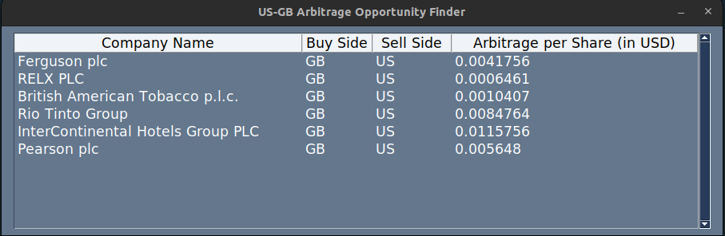

<h1 align="center">US-GB Arbitrage Opportunity Finder</h1>

    
    

## **Project Description**

This is a financial data science project that finds arbitrage opportunities for stocks between the NYSE, NASDAQ and London Stock Exchange. This involves looking for companies that are listed in more than one exchange and try to take advantage of price discrepancy and exchange rates by buying a stock of a company in one exchange and sell it in another one for a "guaranteed and riskless profit".

It is a GUI-based application that uses  [Financial Modeling Prep's](https://site.financialmodelingprep.com/) free financial data API.

 

## **Problems with Deployment**

While developing this project, the main objective was to create a single executable to make it easier for non-tech-savvy people to use it.
However, given that one of the libraries used is **Pandas**, the executable ended with a size of around 350MB, which is unreasonable for a project this simple. Many different methods were used to try and reduce its' size.

Moreover, the use of a web-app, like most of my other projects, would be overkill and repetitive, since there is almost no interaction needed.

I ended up having to re-write the program to not use pandas and other modules by using json instead of csvs, reducing its' size to around 90MB.

 

## **Usage**

### Creating a Free Account
 

First, to be able to use the **free API**, you need to register an account in **Financial Modeling Prep's** website. The registering process is **fairly simple and does not take much of your time**. You can do it in [this](https://site.financialmodelingprep.com/register) page. After this you need to select the **"Free Plan"** to be able to use it.

 

### Obtaining the API Key and Running the Script
 

To access your API Key, you need to copy the key from this [webpage](https://site.financialmodelingprep.com/developer/docs/dashboard/).

    

Then, submit the key and a new window will appear with the results.

    

 

## **Reducing the Number of API Calls**

After you have ran the script, three new files will appear: **NYSE.json, NASDAQ.json and LSE.json**. These contain data on the stocks of each of the exchanges. This data is used by the project every time it is run. The script finds how old these files are and decides if an API call is made. To reduce the amount of these calls, only one is made each day and the next time the program is ran in the same day, it uses the data gathered before.

## **Contributions**
<a href="https://www.flaticon.com/free-icons/money" title="icon">App icon created by pimmip - Flaticon</a>

## **Issues and Suggestions**

If you encounter an error in the program, a way to make the code run faster, any wrong application of financial formulas and concepts or just want to make a suggestion on how to make this project better, raise a new issue [here](https://github.com/TFSM00/US-GB-Arbitrage-Finder/issues/new). 

## 📝 **Licence**

Copyright © 2022 [Tiago Moreira](https://github.com/TFSM00). 
This project is [MIT](https://github.com/TFSM00/US-GB-Arbitrage-Finder/blob/main/LICENSE.txt) licensed.
